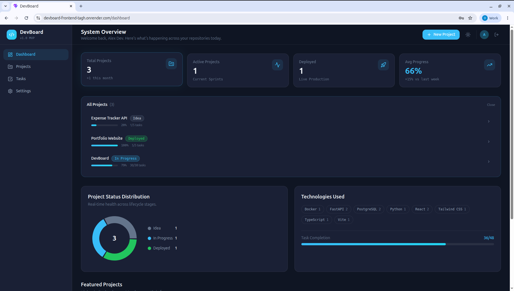
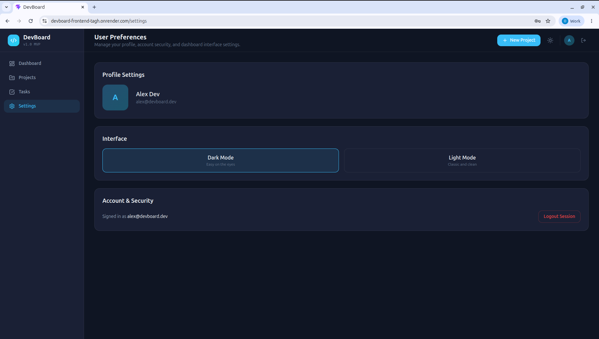
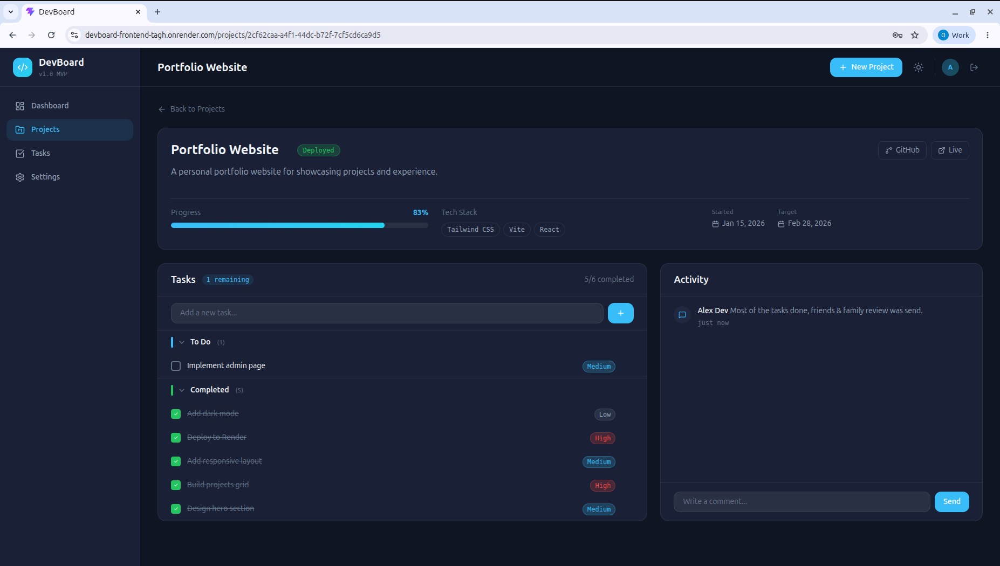

# DevBoard

A full-stack developer dashboard for tracking projects, tasks, and progress. Built with React, FastAPI, and PostgreSQL, orchestrated with Docker Compose.


**[Live Demo](https://devboard-frontend-tagh.onrender.com)** — hosted on Render (free tier, may take ~30s to wake)

[](https://devboard-frontend-tagh.onrender.com)

<details>
<summary>More screenshots</summary>

### Project Detail — Tasks & Activity


### Light Mode


</details>

## Features

- **Project Management** — Create, edit, and track projects with status, progress, and tech stack tags
- **Task System** — Full task CRUD with priority levels (high/medium/low), due dates, and completion tracking
- **Task Detail View** — ClickUp-inspired task modal with inline-editable title, description, priority dropdown, and per-task comments
- **Inline Editing** — Click to edit project titles, descriptions, and status badges directly on the page
- **Activity Feed** — Project-level comment threads with timestamped activity history
- **Dashboard** — Overview with stat cards, project status donut chart, tech stack summary, and task completion metrics
- **Dark/Light Theme** — Persistent theme toggle with CSS custom property system
- **Guest Demo Mode** — Explore the full app without creating an account (pre-populated demo data)
- **JWT Authentication** — Secure login/register with bcrypt password hashing
- **Responsive Design** — Mobile-friendly with slide-out sidebar drawer

## Tech Stack

### Frontend
- React 19 + TypeScript
- Vite 8
- Tailwind CSS 4
- Framer Motion (animations)
- Recharts (dashboard charts)
- React Router v7
- Axios

### Backend
- FastAPI
- SQLAlchemy 2.0 (async-compatible ORM)
- Alembic (database migrations)
- PostgreSQL 16
- JWT authentication (python-jose + bcrypt)
- Pydantic v2 (validation)

### Infrastructure
- Docker Compose (4 services: frontend, backend, db, pgadmin)
- Hot-reload in development for both frontend and backend

## Quick Start

### Prerequisites
- [Docker](https://docs.docker.com/get-docker/) and Docker Compose

### Setup

1. **Clone the repository**
   ```bash
   git clone https://github.com/OsherElikamel/devboard.git
   cd devboard
   ```

2. **Start all services**
   ```bash
   docker compose up --build
   ```

3. **Open the app** (migrations and seed data run automatically on first start)

   - Frontend: [http://localhost:5173](http://localhost:5173)
   - API docs: [http://localhost:8000/docs](http://localhost:8000/docs)
   - pgAdmin: [http://localhost:5050](http://localhost:5050) (admin@devboard.local / admin)

### Demo Login
- Click **"Try as Guest"** on the login page for instant access with pre-populated data
- Or use the seeded account: `alex@devboard.dev` / `demo1234`

## Project Structure

```
devboard/
├── backend/
│   ├── alembic/              # Database migrations
│   ├── app/
│   │   ├── core/             # Config, security, dependencies
│   │   ├── db/               # Database connection, base class, seed
│   │   ├── models/           # SQLAlchemy models
│   │   ├── routers/          # API route handlers
│   │   ├── schemas/          # Pydantic request/response schemas
│   │   ├── services/         # Business logic layer
│   │   └── utils/            # Shared utilities
│   ├── Dockerfile
│   └── requirements.txt
├── frontend/
│   ├── src/
│   │   ├── components/       # Reusable UI components
│   │   │   ├── charts/       # DonutChart
│   │   │   ├── dashboard/    # StatCard
│   │   │   ├── layout/       # AppShell, Sidebar, Topbar
│   │   │   ├── projects/     # ProjectCard, CreateProjectModal
│   │   │   ├── tasks/        # TaskDetailModal, PriorityDropdown
│   │   │   └── ui/           # Badge, ProgressBar, ThemeToggle
│   │   ├── contexts/         # AuthContext, LayoutContext
│   │   ├── pages/            # Dashboard, Projects, Tasks, Settings
│   │   ├── routes/           # Route definitions + guards
│   │   ├── services/         # Axios API client
│   │   ├── types/            # TypeScript interfaces
│   │   └── utils/            # Shared formatting utilities
│   ├── Dockerfile
│   └── package.json
└── docker-compose.yml
```

## API Endpoints

| Method | Endpoint | Description |
|--------|----------|-------------|
| POST | `/api/auth/register` | Create account |
| POST | `/api/auth/login` | Login (returns JWT) |
| GET | `/api/projects` | List user projects |
| POST | `/api/projects` | Create project |
| PATCH | `/api/projects/:id` | Update project |
| DELETE | `/api/projects/:id` | Soft-delete project |
| GET | `/api/projects/:id/tasks` | List project tasks |
| POST | `/api/projects/:id/tasks` | Create task |
| PATCH | `/api/tasks/:id` | Update task |
| DELETE | `/api/tasks/:id` | Delete task |
| GET | `/api/tasks/:id/comments` | List task comments |
| POST | `/api/tasks/:id/comments` | Add task comment |
| GET | `/api/projects/:id/activity` | Project activity feed |
| GET | `/api/dashboard/summary` | Dashboard stats |

## Environment Variables

### Backend (`backend/.env.example`)
| Variable | Description | Default |
|----------|-------------|---------|
| `DATABASE_URL` | PostgreSQL connection string | `postgresql+psycopg://devboard_user:devboard_password@db:5432/devboard_db` |
| `JWT_SECRET_KEY` | Secret for signing JWT tokens | `change_me_in_production` |
| `JWT_ALGORITHM` | JWT signing algorithm | `HS256` |
| `ACCESS_TOKEN_EXPIRE_MINUTES` | Token expiry time | `60` |
| `BACKEND_CORS_ORIGINS` | Allowed CORS origins (JSON array) | `["http://localhost:5173"]` |

### Frontend (`frontend/.env.example`)
| Variable | Description | Default |
|----------|-------------|---------|
| `VITE_API_BASE_URL` | Backend API base URL | `http://localhost:8000/api` |

## License

MIT
